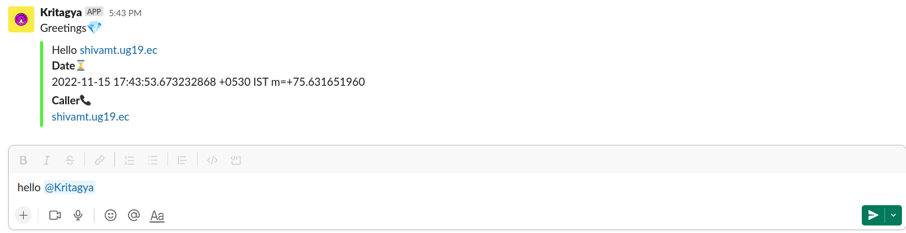

# SlackBot


[Slack](https://slack.com/intl/en-se/) is a communication tool used by developers and companies to share information and communicate. It has grown very popular in recent years.

In this project, we  build a bot that can interact with the Slack workspace and channels.. The bot application will be sending requests to a Go backend via Websocket, something called Socket-Mode in the slack world.


### 👨‍👩‍👦Talk to *Kritagya*

### Set Up the project locally 

- Step 1: Clone the repository
- Step 2: Add a  `.env` file in the root folder , and provide the variables as mentioned in `.env.example`
- Step 3: execute `go run main.go`

**Know your commands**

```kotlin
Hello @Kritagya
```



```kotlin
<Any random comment> @Kritagya
```


```kotlin
**/namaste** <Your Name> 
```


```kotlin
**/red-pill-blue-pill** 
```


